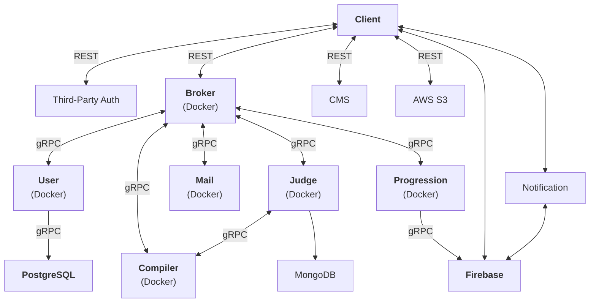

<p align="center">
  
</p>

<p align="center">
  <a href="https://github.com/abyanmajid/codemore.io/blob/main/LICENSE"></a>
  
  
  
  
  
</p>
<p align="center">
  <b>codemore.io</b> is a distributed app that offers <i>free programming courses</i> in attempt to help you get out of <i>"tutorial hell"</i>, or simply <i>speed up your learning</i>, all by putting great emphasis on <i>writing lots of code</i>. At <b>codemore.io</b>, you learn programming by solving a bunch of exercises, quizzes, and building projects with varying level of guidance and hints.
</p>

<!-- <h3 align="center"> Live App 🚀 | Demo 📹 | Documentation 🔍 | Source 📦 </h3> -->

## Architecture

All client requests are sent to the `broker` service (which serves as an API gateway) with a JSON payload. The `broker` service will then redirect this request via `gRPC` to the correct microservice. The following `mermaid` visualizer depicts the architecture:



There are currently 7 API microservices:

1. `broker`: An API gateway to proxy requests to the corresponding service
2. `user`: A microservice responsible for CRUD operations on user information
3. `courses`: A microservice responsible for CRUD operations on course contents
4. `progression`: A microservice responsible for fetching and updating user progress on courses
5. `mail`: A microservice responsible for sending mails
6. `judge`: A microservice responsible for running test cases on code outputs
7. `compiler`: A microservice responsible for compiling user-submitted code

## Design Choices

- Credentials and OAuth2 token-based authentication with JWT
- Role-Based Access Control (RBAC) Authorization
- Asynchronous communication between microservices via gRPC
- Synchronous communication between client and broker via REST
- Sandboxing of code execution in a docker container
- Structured logging to output stream

## Contributing

1. Get started by forking this repository, clone it to your local device, and create a new branch by running `git checkout -b <branch_name>`
2. Open `docker-compose.yml` and make sure all `ENVIRONMENT` environment variables are set to `"development"`
3. Run `make up-build` to pull all required docker images, build binaries, and run all backend microservices in docker containers
4. To set up the frontend client, run `cd web/ui && npm i` from the root to install dependencies
5. Run `cp .env.default .env && rm -rf .env.default` to copy over default environment variables. Make sure `ENVIRONMENT` is set to `"development"`
6. Run `npm run dev` to start the frontend client at `localhost:3000`
7. Refer to the documentation as you make changes
8. Submit a pull request to `staging` when you are done.

**Note on languages:** Since all backend microservices communicate via `gRPC`, all languages that have support for compiling `.proto` files are welcome. To compile `.proto` in Go, `cd` to the directory where your `.proto` file lives in and run the following:
```
protoc --go_out=. --go_opt=paths=source_relative --go-grpc_out=. --go-grpc_opt=paths=source_relative <filename>.proto
```
